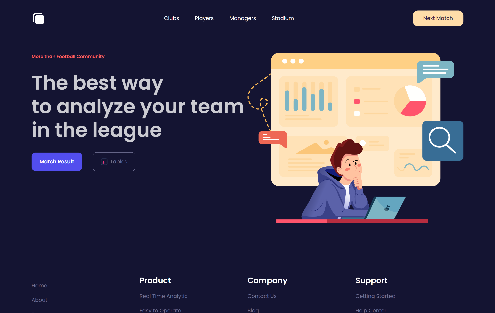

## About This Project

This is a small project that I made. slicing design using laravel and tailwinds. I got the template from [Getshyana Bwa](https://elements.buildwithangga.com/)

## Result this Project

Slicing design landing page using Laaravel 

## License

The Laravel framework is open-sourced software licensed under the [MIT license](https://opensource.org/licenses/MIT).
